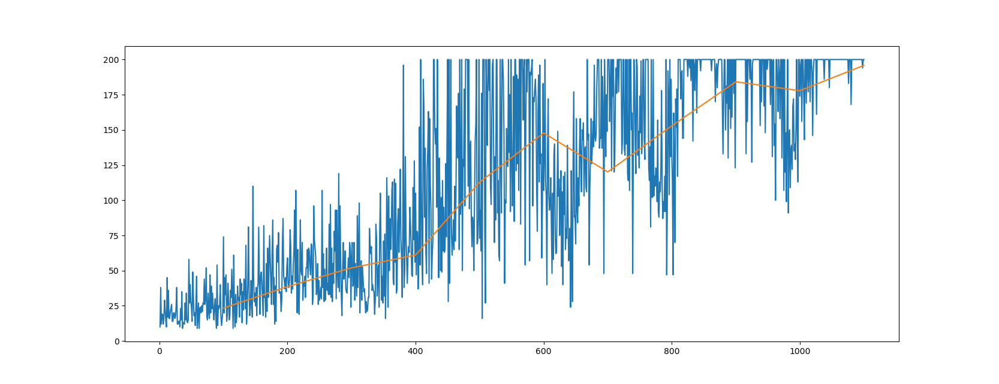
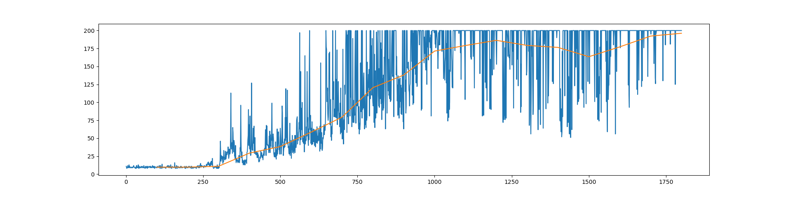
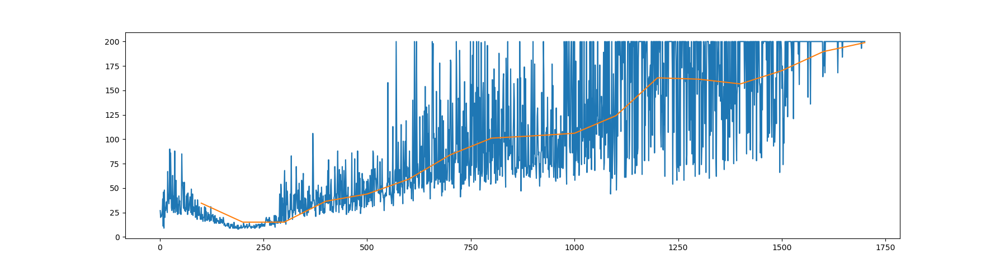
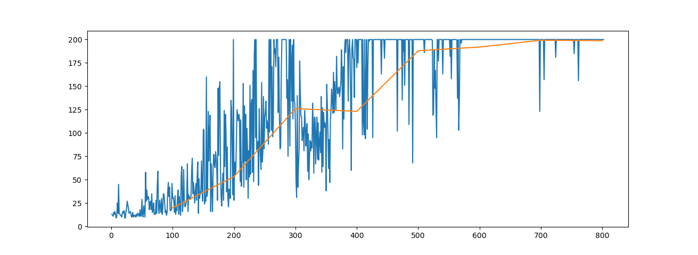

# Reproducing RL Algorithms

Implementation of different RL algorithms in Pytorch.

## Algorithms that were implemented:
Tabular methods: <br>
1. Value Iteration and Policy Iteration [[VI code](Model-based/value-iteration.py) | [PI code](Model-based/policy-iteration.py) | [paper](https://www.ics.uci.edu/~dechter/publications/r42a-mdp_report.pdf)]
2. SARSA [[code](Model-free_Tabular_methods/Sarsa.py) | [paper](http://citeseerx.ist.psu.edu/viewdoc/download?doi=10.1.1.17.2539&rep=rep1&type=pdf)]
3. Q-learning [[code](Model-free_Tabular_methods/Q-Learning.py) | [paper](http://www.cs.rhul.ac.uk/~chrisw/new_thesis.pdf)]
4. SARSA lambda [[code](Model-free_Tabular_methods/Sarsa-lambda.py)]
5. Watkins Q-learning [[code](Model-free_Tabular_methods/Watkins_QLearning.py)]

Deep RL:<br>
1. REINFORCE [[code](vanilla_policy_gradient/REINFORCE.py) | [paper](https://papers.nips.cc/paper/1999/file/464d828b85b0bed98e80ade0a5c43b0f-Paper.pdf)]
2. DQN [[code](DQN/vanilla_w_ER_FixedQ/cartpole/dqn_er_fixedq.py) | [paper](https://www.cs.toronto.edu/~vmnih/docs/dqn.pdf)]
3. Dueling Double DQN [[code](DQN/Dueling-Double_w_ER_FixedQ/cartpole/ddqn.py) | [Double DQN paper](https://arxiv.org/pdf/1509.06461.pdf) | [Dueling DQN paper](https://arxiv.org/pdf/1511.06581.pdf)]
4. A3C [[code](A3C/n-stepTD/a3c.py) | [paper](https://arxiv.org/pdf/1602.01783.pdf)]
5. A2C [[MPI implementation](A2C/n-stepTD/a2c_mpi.py) | [Multiprocessing implementation](A2C/n-stepTD/a2c.py) | [blogpost](https://openai.com/blog/baselines-acktr-a2c/)]
6. PPO [[code](PPO/ppo.py) | [paper](https://arxiv.org/pdf/1707.06347.pdf)]
7. PPG (Work in progress) [[code](PPG/ppg.py) | [paper](https://arxiv.org/pdf/2009.04416.pdf)]

## Commands to Run Scripts
For all non-MPI enabled / algorithms that do not require parallel workers, run the scripts with <br>
``` python3 <filename>```

Command to run MPI-enabled scripts <br>
```mpiexec -n <num_processes> python <filename>.py```


Command to run tensorboard-enabled scripts <br>
```tensorboard --logdir=runs```, <br>
where `runs` is the default folder that tensorboard writes data to

## Implementation Results
These algorithms were all run on [OpenAI Gym's Cartpole environment](https://gym.openai.com/envs/CartPole-v0/)
### REINFORCE 


### DQN


### Dueling DDQN


### A3C


## Sequence of implementation:
- Model-based: VI and PI
- Model-free Tabular methods: Sarsa -> Q-learning -> Sarsa-lambda -> Watkins Q-learning
- VPG (REINFORCE)
- vanilla DQN with experience replay and fixed Q targets
- Double DQN with Dueling architecture, with experience replay and fixed Q targets
- vanilla actor-critic: TD(0) -> MC -> n-step TD
- A3C: MC -> n-step TD with multiprocessing
- A2C: MC -> n-step TD with multiprocessing
- A2C with MPI and tensorboard


